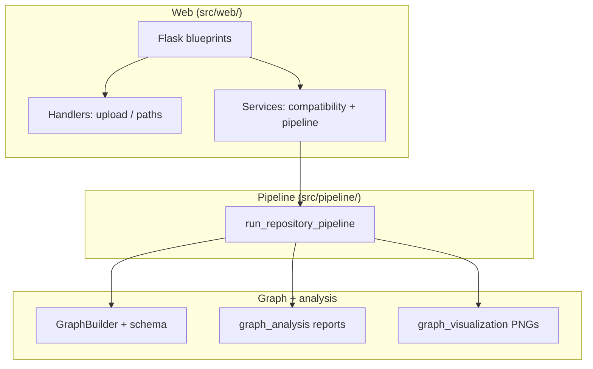

# Midterm project report: GraphRAG-style repository graph analysis (web + pipeline)

**Course context:** Graph theory / software graphs — treating a Python codebase as a **directed attributed graph** for structural insight.

**Repository:** `GraphRAG_Project/` (Flask web UI + CLI pipeline).

**Author:** *[Your name]*  
**Institution:** İTÜ — *[programme]*  
**Date:** May 2026  

---

## 1. Executive summary

This project implements an end-to-end workflow: **ingest a Python repository**, **score it for suitability**, **build a typed graph** (files, symbols, tests; imports and containment edges), **compute degree-based metrics**, **emit text reports**, and **render a gallery of matplotlib/NetworkX charts**. A **Flask web application** guides non-expert users through upload/clone, compatibility review, long-running analysis with **live progress** (Server-Sent Events when supported), and a **results dashboard** with downloads (JSON, TXT, PNG, combined **.docx**).

The midterm artifact emphasizes **what is implemented today**, **what is intentionally deferred** (schema reserves types not yet extracted), and **how large real trees behave** (e.g. the bundled **smolagents** sample under `data/smolagents`).

---

## 2. Problem statement and graph-theoretic framing

### 2.1 Why a graph?

A software repository is naturally modeled as \(G = (V, E)\):

- **Vertices \(V\)** represent entities we care about (here: `File`, `Function`, `Class`, `Test`).
- **Directed edges \(E\)** represent relations with semantics (`IMPORTS`, `IN_FILE`, `TESTS`).

**In-degree / out-degree** and their restriction to a single edge type yield interpretable “hub” and “sink” structure (e.g. heavily imported modules vs. large files that define many symbols).

### 2.2 Scope boundary

The implementation targets **static** Python analysis (AST-based extraction), not dynamic runtime profiling. **TESTS** edges reflect **static** links from tests to symbols, not code coverage.

---

## 3. System architecture

### 3.1 Layered layout



- **`src/web/`**: HTTP, sessions, wiring; calls services; does not embed AST logic in route handlers.
- **`src/pipeline/`**: Single entry `run_repository_pipeline` used by CLI and web.
- **`src/graph/`**: Nodes, edges, builder, JSON schema validation.
- **`src/analysis/`**, **`src/visualization/`**: Operate on built graph artifacts.

### 3.2 Session and disk layout (web)

1. User provides a repo (GitHub HTTPS clone or local path).  
2. Compatibility results are stored in the **Flask session** and shown on `/compatibility`.  
3. `POST /analyze` runs the pipeline; artifacts land under `results/web_analysis_<timestamp>/` (`graph.json`, `analysis.txt`, `visual_summary.txt`, `pipeline.txt`, `visuals/*.png`).  
4. Results page can be re-opened via `GET /analysis-results/<run_dir>`.

---

## 4. Data model (implemented vs reserved)

### 4.1 Implemented node types

| Type | Meaning |
|------|---------|
| `File` | One `.py` module (id = repo-relative path). |
| `Function` | Function or method definition. |
| `Class` | Class definition. |
| `Test` | Extracted test entity from test modules. |

### 4.2 Implemented edge types

| Type | Direction (source → target) |
|------|------------------------------|
| `IMPORTS` | **File → File** (resolved import to another module file in the repo). |
| `IN_FILE` | **Function or Class → File** (symbol defined in that file). |
| `TESTS` | **Test → Function or Class** (static inferred link). |

### 4.3 Reserved in schema but not emitted by current extractors

Defined in `src/graph/schema.py` for forward compatibility:

- **Nodes:** `Commit`  
- **Edges:** `CALLS`, `MODIFIED_BY`  

These are **not** produced by `GraphBuilder` today; the results UI lists only **implemented** types present in the graph document.

---

## 5. Pipeline stages (and new observability)

The orchestrator `run_repository_pipeline` (`src/pipeline/run_pipeline.py`) runs:

1. **Graph build** — `GraphBuilder.build()` walks all Python files (excluding `venv`, `node_modules`, `__pycache__`).  
   - **Progress / logs:** optional `file_progress(stage, index, total, path)` reports **scan**, **extract**, and **tests** phases with **relative paths**.  
   - **Logging:** `logger.info` batches during scan/extract/tests (throttled so huge repos do not flood logs).
2. **Validation + save** — `validate_graph_contract`, `save_graph`.  
3. **Analysis** — `generate_analysis_text_report` loads JSON, computes per-type degree tables, formats text.  
   - **Progress:** explicit steps (load → compute → assemble).  
4. **Visualization** — `generate_visual_summary` renders multiple PNGs (structure subgraphs + degree bar charts per edge type) and a text summary.  
   - **Progress:** one callback before each major matplotlib step; **INFO** log line per saved PNG path.

**Web UI:** `POST /analyze` with `X-GraphRAG-Analyze-Stream` streams **SSE** `progress` events carrying these messages. If the WSGI server buffers the stream, the compatibility page falls back to **timed milestone hints** (each line includes **elapsed seconds** and a **unique wait index** so the same sentence never repeats verbatim).

**Terminal / file logs:** set `GRAPHRAG_LOG_LEVEL=INFO` (see `README.md`) and tail `logs/graphrag.log` (or stderr) to follow the same pipeline without the browser.

---

## 6. Web application (screenshots)

> **Figures:** add PNG files under `docs/assets/` using the names below.

### 6.1 Landing and input


*Figure 1 — Repository input: GitHub URL clone or local path; progressive upload uses `fetch` + `X-GraphRAG-Progressive-UI` for validation errors without a full page round-trip.*

### 6.2 Compatibility gate


*Figure 2 — Weighted compatibility checks before graph analysis; expandable rows explain each criterion.*

### 6.3 Long-running analysis overlay


*Figure 3 — Progress overlay with cumulative status lines (SSE when available, timed milestones otherwise).*

### 6.4 Results dashboard


*Figure 4 — Node/edge counts, implemented types, and plain-language edge semantics.*

### 6.5 Chart gallery and exports


*Figure 5 — PNG gallery with per-chart download and bundled `.docx` export.*

---

## 7. Example repositories

### 7.1 Bundled sample: **smolagents** (`data/smolagents`)

The workspace includes a **cloned third-party tree** under `GraphRAG_Project/data/smolagents` (see `.gitignore` / project rules: treat `data/` as sample material). It is useful because it:

- Contains **many** Python files → stresses **graph build** and **matplotlib** runtime.  
- Demonstrates **IMPORTS** density across an agent framework.  
- Produces **large** `graph.json` outputs — good for degree distribution charts.

**Suggested command-line experiment** (from project root, after `pip install -r requirements.txt`):

```bash
python -m src.build_graph --repo "data/smolagents" --output "results/demo_smolagents_graph.json"
```

The web flow runs the full pipeline (build + analyze + visualize), not only `build_graph`.

### 7.2 Smaller sanity example

Any small single-package repo (e.g. a course homework folder with a handful of modules) validates:

- Fast iteration on **UI** and **schema** changes.  
- Readable **structure** subgraphs when the graph is not huge.

### 7.3 What “success” looks like

- **`graph.json`:** non-empty `nodes` / `edges`, `implemented_node_types` / `implemented_edge_types` populated.  
- **`analysis.txt`:** edge counts by type + top-k in/out degree sections.  
- **`visuals/*.png`:** eight chart variants when visualization is enabled (four structure + four degree, subject to empty subgraph guards).

---

## 8. Implemented vs missing (concise matrix)

| Area | Implemented | Missing / future |
|------|-------------|------------------|
| Languages | Python `.py` under repo root | Other languages; notebooks |
| Nodes | File, Function, Class, Test | `Commit` nodes |
| Edges | IMPORTS, IN_FILE, TESTS | `CALLS`, `MODIFIED_BY` |
| Analysis | Static degree / ranking text | PageRank, communities, temporal graphs |
| Viz | Matplotlib + NetworkX PNGs | Interactive webGL graph explorer |
| Web | Upload URL/path, compatibility, analyze, results, DOCX | ZIP upload in main UI (handler exists) |
| Streaming | SSE progress + HTML fallback | Guaranteed flush on Flask dev server (WSGI-dependent) |
| RAG / LLM | Not in scope for this graph milestone | Retrieval over graph + LLM Q&A |

---

## 9. Engineering risks and mitigations

| Risk | Mitigation implemented |
|------|-------------------------|
| Long POST request timeouts | Streaming SSE + redirect; user instructed to keep tab open; server logs for diagnosis |
| Buffered SSE on dev server | HTML fallback + timed overlay; **INFO** logs with file/chart granularity |
| Huge JSON in browser | Downloads use blob URLs; results page embeds payload for exports |

---

## 10. Conclusion and next steps

**Delivered:** a coherent **graph schema**, **deterministic pipeline**, **web UX** from ingest to artifacts, and **observability** (SSE + logging + per-file/per-chart progress hooks).

**Plausible next milestones for the final report:**

1. Emit **`CALLS`** edges from static analysis (caller → callee) under a feature flag.  
2. **Interactive graph** (subset) in the browser with zoom/filter by edge type.  
3. **ZIP** upload exposed in `index.html` with the same compatibility gate.  
4. Optional **embedding** step: chunk symbols/files → vector index → “ask the repo” (true GraphRAG).

---

## References (internal)

- `docs/PROJECT_STRUCTURE.md` — module map.  
- `docs/WEB_APPLICATION_GUIDE.md` — routes and headers.  
- `src/graph/schema.py` — canonical type sets.  
- `src/pipeline/run_pipeline.py` — orchestration and progress contract.
