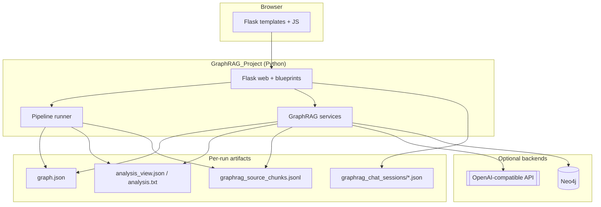
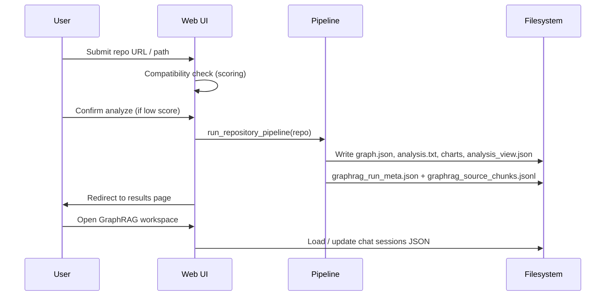
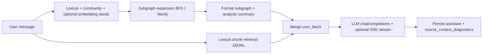

# Project Delivery Report — GraphRAG-Based Repository Quality Analysis

**Course / context:** Graph Theory (graduate project) — *adjust to your department template*  
**Project:** GraphRAG_Project — graph-theoretic modeling of Python repositories, automated analysis, and conversational retrieval  
**Author(s):** *[YOUR NAME(S)]*  
**Institution:** Istanbul Technical University (İTÜ) — *[YOUR PROGRAM / COURSE CODE]*  
**Submission date:** *[YYYY-MM-DD]*  
**Repository root:** `GraphRAG_Project/`

---

## Table of contents

1. [Executive summary](#executive-summary)  
2. [Problem statement and objectives](#problem-statement-and-objectives)  
3. [System overview](#system-overview)  
4. [Architecture](#architecture)  
5. [End-to-end pipelines and data flow](#end-to-end-pipelines-and-data-flow)  
6. [Graph model and analysis](#graph-model-and-analysis)  
7. [GraphRAG assistant (retrieval + LLM)](#graphrag-assistant-retrieval--llm)  
8. [Web application features](#web-application-features)  
9. [Configuration, logging, and operations](#configuration-logging-and-operations)  
10. [Testing and quality](#testing-and-quality)  
11. [Limitations and future work](#limitations-and-future-work)  
12. [Conclusion](#conclusion)  
13. [Figures (placeholders)](#figures-placeholders--add-your-screenshots-under-docsassets)  
14. [Appendices](#appendices)

---

## Executive summary

This project delivers a **web-first Python stack** that turns a target Python repository into a **typed property graph**, computes **graph-theoretic and statistical summaries** (centralities, communities, composite risk signals), renders **charts and text reports**, and exposes everything through a **Flask** UI. A **GraphRAG** assistant answers natural-language questions by combining **bounded subgraph retrieval** over the graph, **precomputed analysis text**, and **lexically ranked source chunks** from:

- indexed **Python** files (`File` nodes in `graph.json`);
- **Markdown documentation** across the repository (`*.md`, plus selected root text files);
- **persisted analysis artifacts** for the same run (formatted `analysis_view` metrics, `analysis.txt`, `visual_summary` payloads) under virtual `_analysis/` paths in the same chunk index.

The assistant calls an **OpenAI-compatible** HTTP API (hosted providers or **Ollama** locally). Optional **Neo4j** accelerates subgraph expansion; optional **embedding** calls improve seed ranking. Multi-turn chat is **session-persisted**; the workspace can show **which chunks** were sent to the model, including an **expandable excerpt** of each chunk for traceability.

---

## Problem statement and objectives

| Goal | Outcome in this project |
|------|-------------------------|
| Represent software as a graph | Nodes: `File`, `Function`, `Class`, `Test`, `Commit`; edges: `IMPORTS`, `IN_FILE`, `CALLS`, `TESTS`, `MODIFIED_BY`, … (`docs/GRAPH_SCHEMA.md`) |
| Quantify structure and risk | Degree / betweenness / PageRank tables, Louvain-style community summaries, composite **risk** rows derived from z-scores on files |
| Make results inspectable | Web results page, downloads (JSON, text, PNG, optional `.docx`), optional Neo4j preview |
| Support exploratory Q&A | GraphRAG workspace: streaming replies, Markdown, source diagnostics with excerpts |

---

## System overview

At a high level the product is three cooperating planes:

1. **Ingestion & graph build** — discover `*.py`, parse symbols/imports/tests, attach git commits when available, serialize `graph.json`.  
2. **Analysis & visualization** — run metrics, write `analysis.txt`, structured `analysis_view.json`, `visual_summary` artifacts, and chart PNGs under the run folder.  
3. **Conversation layer** — for each chat turn, rank seeds, expand a **typed, budgeted subgraph**, merge **metrics + subgraph + source chunks**, then call the LLM.

---

## Architecture

The codebase follows a **layered** layout under `src/`: web and HTTP wiring stay in `src/web/`; graph construction in `src/graph/`; analysis in `src/analysis/`; GraphRAG orchestration in `src/graphrag/`; pipeline orchestration in `src/pipeline/`. The web app never shells out to the CLI pipeline script in-process; it calls `run_repository_pipeline` from Python.

### C4-style context (containers)

### Layer responsibilities (concise)

| Layer | Role |
|-------|------|
| `src/web/` | HTTP routes, sessions, wiring to services, SSE for long operations |
| `src/pipeline/` | Single orchestrated run: build graph → analyze → visualize |
| `src/graph/` | Schema, builder, JSON load helpers |
| `src/analysis/` | Centrality, communities, risk scoring, textual report |
| `src/graphrag/` | Seed ranking, subgraph expansion (NetworkX or Neo4j), context formatting, **source chunk index + retrieval**, LLM HTTP client, chat orchestration |
| `src/compatibility/` | Pre-flight repo scoring before expensive runs |

---

## End-to-end pipelines and data flow

### Web analysis pipeline (primary user journey)

### GraphRAG chat turn (logical steps)

**Source index (`graphrag_source_chunks.jsonl`)** — single newline-delimited JSON stream consumed by `retrieve_source_context_for_llm`:

1. Chunks from each indexed `.py` file (line windows from env).  
2. Chunks from documentation: root README-style files, then **every** `*.md` under the repo (subject to `GRAPHRAG_SOURCE_MAX_DOC_FILES` and path exclusions).  
3. Chunks from **this run’s** analysis bundle: formatted `analysis_view` text, `analysis.txt`, `visual_summary` files — stored under paths such as `_analysis/analysis_view.txt` so queries like “riskiest file” overlap with **centrality and risk** sections.

Retrieval uses the same **lexical scorer** (`score_query_against_blob`) for every chunk line: substring bonus plus token overlap between the user question and `path + chunk_text`.

---

## Graph model and analysis

- **Construction:** `src/graph/graph_builder.py` (and extractors) walk the repository, normalize paths, and emit a JSON graph document.  
- **Metrics:** `src/analysis/graph_analysis.py` produces summaries consumed by the UI cards and `analysis_view.json`.  
- **Risk signal (conceptual):** combines normalized signals such as centrality, commit churn (`MODIFIED_BY`), test presence gaps, and cross-community exposure where available — surfaced as ranked **file** candidates in `analysis_view` and echoed into indexed `_analysis/` text for chat.

---

## GraphRAG assistant (retrieval + LLM)

- **Seeding:** `query_index.rank_seed_node_ids` plus optional community and embedding merges (`embedding_seeds.py`).  
- **Subgraph:** Undirected BFS with edge-type filters; Neo4j path mirrors the same semantics when Bolt is configured.  
- **Context package:** `context_formatter.py` for subgraph text; `analysis_context.format_analysis_view_summary` for a short metrics digest (still sent separately in the prompt); **source excerpts** add code, docs, and analysis-derived text.  
- **Streaming:** Workspace sends `X-GraphRAG-Chat-Stream: 1`; server emits SSE `progress` / `token` / `complete`.  
- **Diagnostics:** `source_context_diagnostics` stores `included_chunks` with `path`, `score`, `lines`, optional `kind` (`documentation`, `analysis_report`), and **`excerpt`** (truncated raw chunk text for the UI expandable panel).

---

## Web application features

- **Landing / upload:** GitHub clone or local path (ZIP reserved).  
- **Compatibility:** Weighted checklist with user confirmation on low scores.  
- **Progress:** SSE during analyze; client waits for stream completion before navigation where required.  
- **Results:** Metrics cards, downloads, chart gallery, optional Neo4j property-graph preview.  
- **GraphRAG workspace:** Project list, sessions, Markdown rendering (`marked` + `DOMPurify`), delete modal, optional automatic session fork when prompts exceed configured character thresholds.  
- **Source panel:** Collapsible “Source snippets” with per-hit **chunk text** preview when excerpts are present in saved diagnostics.

---

## Configuration, logging, and operations

- **Secrets / API:** `.env` (see `.env.example`): `FLASK_SECRET_KEY`, `GRAPHRAG_OPENAI_BASE_URL`, `GRAPHRAG_CHAT_MODEL`, optional `GRAPHRAG_OPENAI_API_KEY`, `GRAPHRAG_CHAT_TIMEOUT_S`.  
- **Neo4j:** `GRAPHRAG_NEO4J_URI`, user, password, optional database.  
- **Embeddings:** `GRAPHRAG_EMBEDDING_MODEL` + cache file `graphrag_embedding_cache.npz` per run.  
- **Source index tuning:** `GRAPHRAG_SOURCE_*` for Python windows; `GRAPHRAG_SOURCE_MAX_DOC_FILES`, `GRAPHRAG_SOURCE_DOC_CHUNK_*` for Markdown; `GRAPHRAG_SOURCE_ANALYSIS_*` and `GRAPHRAG_SOURCE_DISABLE_ANALYSIS_CHUNKS` for analysis chunks; `GRAPHRAG_SOURCE_DIAGNOSTIC_EXCERPT_CHARS` for UI excerpts (set `0` to omit).  
- **Logging:** `GRAPHRAG_LOG_LEVEL`, rotating `logs/graphrag.log` per project rules.

**Operational note:** If you change indexing rules, **re-run the web pipeline** for a given `results/web_analysis_*` folder or delete `graphrag_source_chunks.jsonl` so it can be rebuilt (on-demand rebuild requires `graphrag_run_meta.json` and a still-valid `source_repo_root`).

---

## Testing and quality

- Automated tests under `tests/` cover session persistence and **source index / retrieval** (Python, Markdown, and `_analysis/` chunks).  
- Recommended manual smoke: `pytest -q`, start `python run_web_app.py`, run one analysis, open workspace, ask a **risk** question and confirm `_analysis/` hits appear in Source snippets.

---

## Limitations and future work

- Retrieval is still **lexical** at the chunk stage; vector DB backends and chart `image_url` hints are described in `docs/GRAPHRAG_CHAT_ROADMAP.md`.  
- Very large monorepos may require raising caps or excluding noisy subtrees (future: configurable ignore globs).  
- LLM answers remain **probabilistic**; diagnostics show what was retrieved, not a formal proof of correctness.

---

## Conclusion

The system closes the loop from **repository → graph → metrics → persisted artifacts → grounded chat**, with explicit extension points (Neo4j, embeddings, richer retrieval backends) documented for future iterations.

---

## Figures *(placeholders — add your screenshots under `docs/assets/`)*

Create `docs/assets/` if needed. Keep filenames so links resolve from this `docs/` path.

<!-- PLACEHOLDER FIGURE 1 -->

**Caption:** Landing page and repository submission.

---

<!-- PLACEHOLDER FIGURE 2 -->

**Caption:** Compatibility scoring and confirmation flow.

---

<!-- PLACEHOLDER FIGURE 3 -->

**Caption:** Streaming pipeline progress.

---

<!-- PLACEHOLDER FIGURE 4 -->

**Caption:** Metrics, charts, and download actions.

---

<!-- PLACEHOLDER FIGURE 5 -->

**Caption:** Optional interactive graph preview.

---

<!-- PLACEHOLDER FIGURE 6 -->

**Caption:** Chat, Steps panel, Source snippets with expandable chunk excerpts.

---

<!-- PLACEHOLDER FIGURE 7 -->

**Caption:** JSON / text / docx exports.

---

## Appendices

### Appendix A — Suggested screenshot filenames

| File | Content |
|------|---------|
| `docs/assets/delivery_fig01_home.png` | Upload / clone entry |
| `docs/assets/delivery_fig02_compatibility.png` | Compatibility |
| `docs/assets/delivery_fig03_analysis_progress.png` | SSE progress |
| `docs/assets/delivery_fig04_results_dashboard.png` | Results |
| `docs/assets/delivery_fig05_graph_preview.png` | Graph preview |
| `docs/assets/delivery_fig06_graphrag_workspace.png` | Workspace + source excerpts |
| `docs/assets/delivery_fig07_exports.png` | Downloads |

### Appendix B — Key internal references

- `README.md` — install, env vars, feature list  
- `docs/PROJECT_STRUCTURE.md` — modules and flow  
- `docs/GRAPH_SCHEMA.md` — node/edge definitions  
- `docs/GRAPHRAG_CHAT_ROADMAP.md` — vector store / multimodal follow-ups  

### Appendix C — Glossary

| Term | Meaning |
|------|---------|
| GraphRAG | Graph-first retrieval augmented generation: subgraph + text artifacts + LLM |
| `graph.json` | Serialized property graph for one analyzed repository snapshot |
| `analysis_view.json` | Structured metrics for the results UI and short LLM digest |
| `graphrag_source_chunks.jsonl` | Mixed index: code + docs + `_analysis/` virtual paths |
| SSE | Server-Sent Events for streaming HTTP responses |

---

*End of delivery report.*
